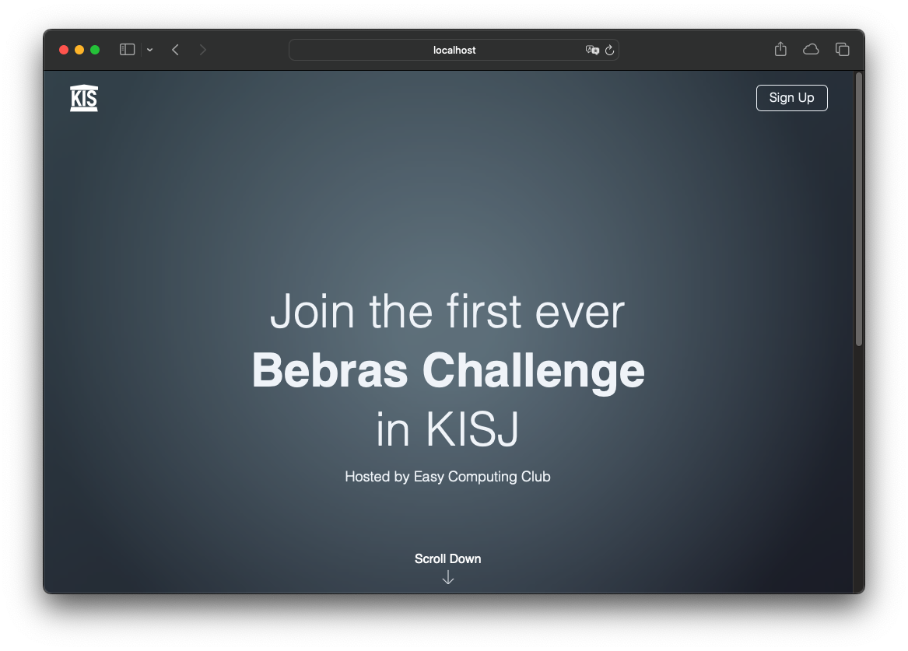

# bebars-promo

This is a simple website written in VUE.js to promote Bebras Challenge in Korea International School Jeju.

# Development
### Prerequisites
- Node.js
- Yarn
- Vue CLI

### Setup
1. Clone this repository
2. Run `npm install` to install dependencies
3. Run `npm run dev` to start development server
4. When you are done, run `npm run build` to build the website